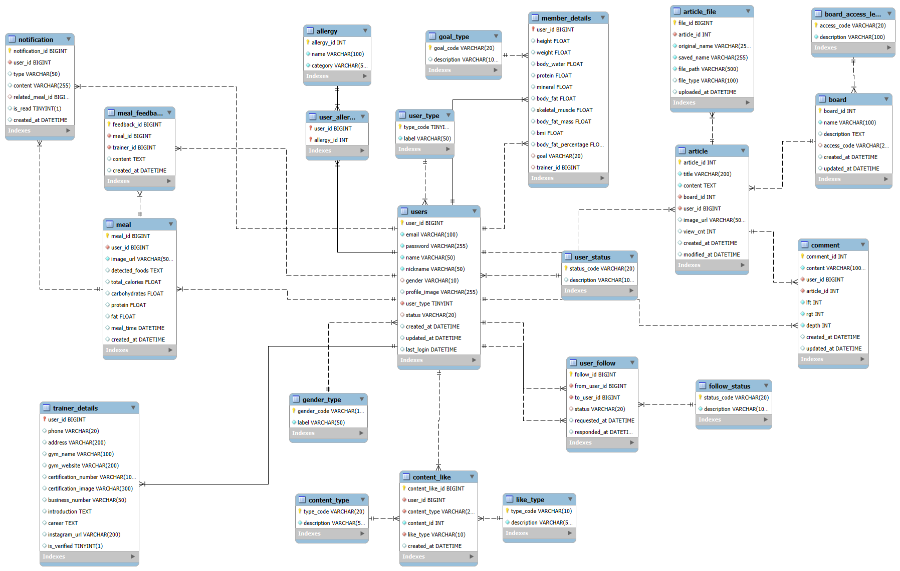
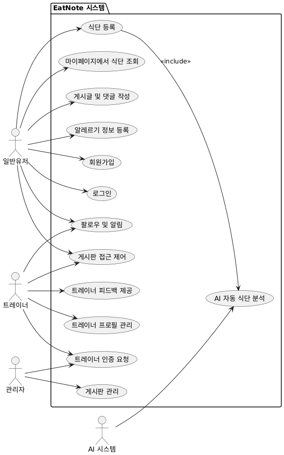

# EatNote 🍽️  
> AI와 트레이너가 함께 도와주는 식단 피드백 플랫폼

---

## 📌 프로젝트 개요

**EatNote**는 회원이 식단 사진을 간편하게 업로드하면  
AI가 1차 분석하여 자동 피드백을 제공하고,  
트레이너가 이를 기반으로 최종 피드백을 제공하는 식단 피드백 플랫폼입니다.  
회원 간 팔로우 기능, 자유 게시판, 식단 목표에 맞는 영상 추천 등의 기능을 통해  
더욱 체계적이고 즐거운 식단 관리 환경을 제공합니다.

---

## 🧩 핵심 기능

### 👤 사용자 관리
- 회원가입 (트레이너 / 일반회원 구분)
- 이메일 인증 및 로그인
- 마이페이지 및 프로필 수정

### 🍱 식단 등록 및 피드백
- 식단 이미지 업로드
- AI 기반 자동 분석 피드백
- 트레이너의 수동 피드백 추가
- 피드백 이력 열람

### 🤝 커뮤니티 기능
- 회원 간 팔로우 및 식단 열람
- 자유게시판: 글 작성, 댓글, 좋아요
- 대댓글 트리 구조 지원

### 🎥 영상 추천
- 사용자의 식단 목표에 따른 운동/식단 관련 YouTube 영상 추천

---

## 🛠 기술 스택

| 영역 | 사용 기술 |
|------|-----------|
| Backend | Java 17, Spring Boot, MyBatis, JWT, Swagger |
| Database | MySQL |
| Frontend | JSP, JavaScript, Bootstrap |
| AI 분석 | Google Vision API (예정) |
| 배포 | Apache Tomcat, GitHub, (예정: AWS 또는 클라우드) |

---

## 🗂️ 프로젝트 구조
```
eatnote/
├── controller/
│ └── AuthController, UserController, ArticleController ...
├── model/
│ ├── dao/ # MyBatis 인터페이스
│ ├── dto/ # Entity, Request/Response DTO
│ └── service/ # 비즈니스 로직
├── resources/
│ ├── mapper/ # MyBatis XML
│ └── static/, templates/
├── security/ # JWT 인증 처리
└── application.yml # 환경 설정
```

---

## 🌱 향후 계획

- AI 분석 피드백 정교화 (영양소 추정, 위험 요소 식별)
- 식단별 통계/분석 리포트 기능
- 트레이너와 회원 간 채팅 or 상담 예약 기능
- 앱 버전 출시

---

## ERD


## UML Diagram



## figma
https://www.figma.com/design/Khs3ezjB6AIC8muq5amHqK/-%EC%84%9C%EC%9A%B8_8%EB%B0%98_%EC%96%91%ED%98%84%EC%84%9C--s-team-library?node-id=3311-2&t=SWrfvhjr4VI75slb-1
